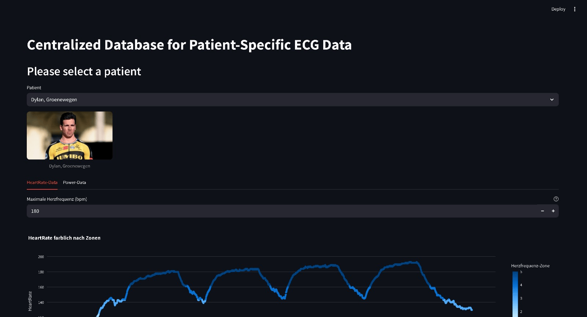
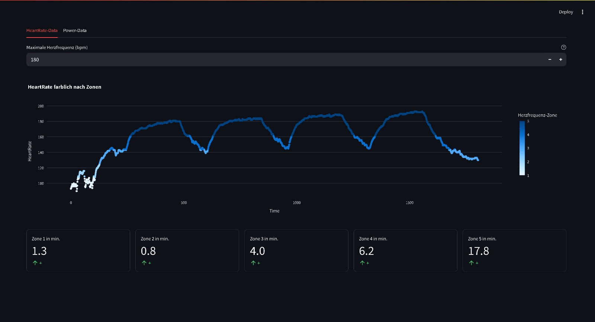
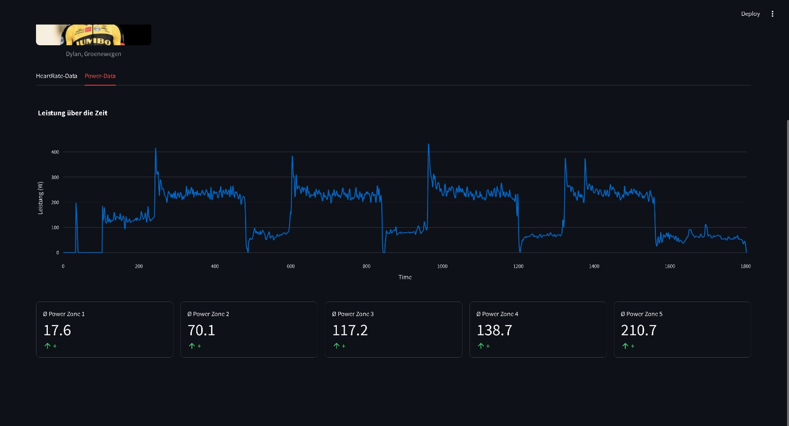

# Exercises for the course Programming 2
# Aufgabe 3 bis 5
*Group members:*
*1. Marius Valenta*
*2. Simon Schwarzer*

## Exercise 2: Interactive plot

In this task, we use Pandas to analyze power and heart rate data from a .csv file (activity.csv). We first load the data into a DataFrame and calculate both the mean and maximum power values. Using Plotly, we create an interactive plot displaying power and heart rate over time. The heart rate data is used to divide the activity into five zones based on a user-input maximum heart rate, and the time spent in each zone is shown in the app. Also, the average power in each zone is calculated and displayed.

## App:

## Execution:
1. Clone this repository in VS Code
2. Open a new terminal in VS Code and run `pdm install`
3. Run `streamlit run main.py`to host the App
